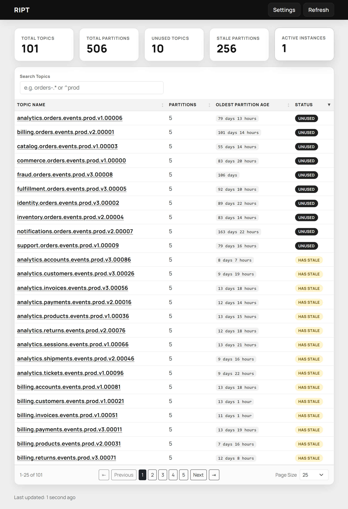

# RIPT - Reclaimer of Inactive Partitions and Topics

Did you know at one million messages per second, a partition's "the ever increasing offset" would take [about 290 years to exhaust](https://kafka.apache.org/42/design/protocol/#protocol-primitive-types/).

ZK-based clusters become unstable beyond ~200,000 partitions; KRaft-based clusters raise that ceiling significantly, with two million partitions [tested in a lab](https://docs.confluent.io/platform/current/kafka-metadata/kraft.html#scaling-ak-with-kraft).

Motivation to reclaim unused topics still strong even with Kraft improvements, In 2022 LinkedIn engineers shared a [blog post](https://www.linkedin.com/blog/engineering/infrastructure/topicgc_how-linkedin-cleans-up-unused-metadata-for-its-kafka-clu), reducing the number of topics by 20%, request latencies dropped by up to 40% and CPU usage had seen 30% drop, this is simply because every partition still has its metadata stored and served.

But creating a pipeline that collects metrics/insights from other data sources than Kafka, requires more work.

So I created RIPT:

A lightweight (for already busy Kafka clusters), stateless Go daemon that monitors Apache Kafka topics to identify which topics are not being actively used. The application tracks offset age (how long since offsets were last updated).  **This means RIPT can only show you unused topics after a while and not immediately.**

I wanted RIPT to be:
* Stateless - no external dependencies
* Portable - works across clusters regardless of observability setup
* Low footprint - safe to run on already-busy clusters
* Open source
* Elegant in its simplicity

Background:

One day I came across to [a simple but beautiful PromQL](https://github.com/strimzi/strimzi-kafka-operator/blame/e1f55616b71eb5751edc1c517536188d01664538/examples/metrics/prometheus-install/prometheus-rules/prometheus-kafka-exporter-topic-rules-group.yaml#L29) and that clicked instantly.  Someone (way smarter than I am) quietly and unknowingly created a simple solution to my problem, by checking the ever increasing offsets.

If you are collecting your Kafka cluster's JMX metrics to Prometheus, RIPT is overengineered version of this query.

If you want to give RIPT a try that's fine, it has some other properties, it has a low footprint on Kafka Cluster, you don't even need to run it all the time, a daily run would also be useful, it is talking to Kafka APIs directly and doing it efficiently, [franz-go](https://github.com/twmb/franz-go) doing the heavy lifting, requests are batched, connections are kept-alive, and it is almost infinitely scalable, all these little details make sense if your cluster already busy and maxed out. I've seen cases where a single scraping of JMX metrics takes a minute or two, Kafka APIs are more efficient and RIPT is careful about requests it makes.

RIPT can also report you the stalled partitions even if the topic is being used, this happens when a producer is not partitioning messages as expected to all partitions.

## How It Works

1. **Initialization**: On startup, RIPT reads the last checkpoint from `ript-state` topic
2. **Scanning**: Every N minutes (configurable):
   - Lists all topics in the cluster (excluding system topics)
   - Fetches current high-watermark offsets for each topic in batched requests
   - Compares with previous state to detect changes
3. **Age Calculation**: For each partition:
   - If offset has not changed since last scan, the previous timestamp is preserved and age increases
   - If offset changes, the partition timestamp resets to scan time
4. **Persistence**: After each scan, latest snapshot saved to `ript-state`
5. **Status**: Topics marked as "unused" if all partitions not updated in 30+ days (configurable)

See [quickstart](QUICKSTART.md)

OpenAPI specification: [openapi.yaml](openapi.yaml)
