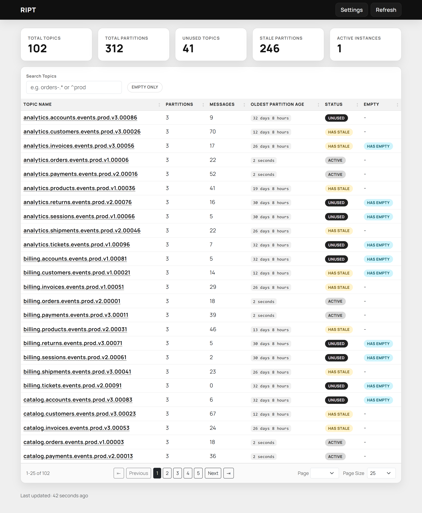

[](https://deepwiki.com/omersiar/ript)

# RIPT - Reclaimer of Inactive Partitions and Topics

Apache Kafka clusters accumulate dead weight over time.

Unused topics become invisible overhead that drags performance.

RIPT finds them.

RIPT is a stateless Go tool that monitors Kafka topics and flags the ones no one is using — with minimal impact on your cluster.

In 2022 LinkedIn engineers shared a [blog post](https://www.linkedin.com/blog/engineering/infrastructure/topicgc_how-linkedin-cleans-up-unused-metadata-for-its-kafka-clu), reducing the number of topics by 20%, request latencies dropped by up to 40% and CPU usage had seen 30% drop, this is simply because every partition still has its metadata stored and served.

RIPT needs only one signal — how long since a topic or partition was last updated. No metrics pipelines, no JMX, no broker-side setup.

#### Features:

* Stateless - no external dependencies
* Portable - it works regardless of observability setup
* Low footprint - extremely careful about the requests it makes, safe to run on already-busy clusters
* Scalable - Automatic, zero-conf sharding, just run more instances of the RIPT
* It can be run as a long-running daemon or as CLI, can also run as a cron job
* You don't need to run it all the time, a daily run would also be useful
* It can report empty topics
* It can report stalled partitions, this happens when a Kafka producer is not partitioning messages as expected to all partitions.

#### Get started:

#### Docker / Podman 
Container images can be downloaded from [ghcr.io](https://github.com/omersiar/ript/pkgs/container/ript)

```bash
cat << EOF > .env
RIPT_KAFKA_BROKERS=kafka:9092
RIPT_STATE_TOPIC=ript-state-topic
RIPT_SCAN_INTERVAL_MINUTES=5
EOF
```
or copy the .env.example

`cp .env.example .env`

`docker run -P --env-file ./.env ghcr.io/omersiar/ript:latest`

docker-compose example

```bash
git clone https://github.com/omersiar/ript.git
cd ript
cp docker-compose.yml.example docker-compose.yml
docker compose up
```

#### Binary from GitHub [releases](https://github.com/omersiar/ript/releases)


To run it either create an .env file:

```bash
cat << EOF > .env
RIPT_KAFKA_BROKERS=kafka:9092
RIPT_STATE_TOPIC=ript-state-topic
RIPT_SCAN_INTERVAL_MINUTES=5
EOF
```
or copy the .env.example

```bash
cp .env.example .env
```

if you would like to export them:

```bash
export RIPT_KAFKA_BROKERS=kafka:9092
export RIPT_STATE_TOPIC=ript-state-topic
export RIPT_SCAN_INTERVAL_MINUTES=5

./ript
```

#### Build it yourself
```bash
git clone https://github.com/omersiar/ript.git
cd ript
make build

export RIPT_KAFKA_BROKERS=kafka:9092
export RIPT_STATE_TOPIC=ript-state-topic
export RIPT_SCAN_INTERVAL_MINUTES=5
./bin/ript
```

For more see [quickstart](QUICKSTART.md).

[](https://github.com/omersiar/ript)

MIT Licensed